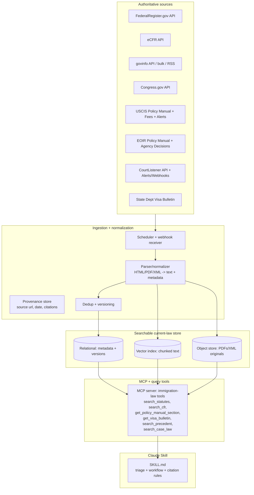

# Creating an Immigration-Attorney Skill for Claude

## Executive summary

Anthropic “Skills” are folder-based packages centered on a `SKILL.md` file (Markdown + YAML frontmatter) that Claude can discover and load dynamically (“progressive disclosure”). The frontmatter (especially `description`) is the trigger mechanism; the body and any linked files are loaded only when needed, which keeps token use low and reduces context clutter. citeturn11view0turn13view0turn31view0

There are three practical build-and-distribute paths, and choosing the right one is the real architectural fork:

* **Standalone Skill (ZIP) for Claude.ai / Cowork / add-ins**: simplest distribution—zip a skill folder and upload in Claude settings; org owners can provision skills for everyone. citeturn7view1turn8view2turn15view0  
* **Claude Code Skill / Plugin**: best for engineer workflows; adds invocation controls (`disable-model-invocation`, `user-invocable`), tool allowlists (`allowed-tools`), hooks, shell-injected live context, and plugin marketplaces for updates. citeturn17view0turn19view1turn23view0turn22view2  
* **Desktop Extension (.mcpb) + MCP server**: best when you need durable authenticated connectors (case-management systems, document stores, your own legal knowledge service) packaged with a `manifest.json`, bundled runtime/deps, secure secrets in OS keychain, and automatic updates. citeturn30view1

For an **immigration-attorney skill**, the dominant pattern is that **the “skill file” should contain process, triage, and citation discipline—not time-sensitive law**. Immigration policy changes frequently; Anthropic’s own guidance warns against embedding time-sensitive details in skill bodies and instead recommends structuring skills as navigable overviews that pull fresh material from referenced files and tools. citeturn31view0turn11view0

Your attached proof-of-concept is structurally close (clear triage, disclaimers, modular topic files), but it has a critical packaging bug: `SKILL.md` references files under `references/…` while the provided files are not in a `references/` directory. That will cause file lookups to fail at runtime unless you move the files or fix paths. fileciteturn0file0

If you want this to behave like an “immigration attorney” rather than a generic explainer, the major missing capability is **currency**: you’ll need a retrieval layer (ideally via MCP tools) backed by authoritative sources (USCIS Policy Manual, EOIR Policy Manual + precedent decisions, Federal Register, eCFR, govinfo, CourtListener alerts/webhooks, etc.) with ingestion and provenance tracking. citeturn35search0turn35search10turn32search0turn32search3turn33search0

## Anthropic skill creation and lifecycle

### Skill file requirements and schema

A skill is a directory containing (at minimum) `SKILL.md`; common optional directories are `scripts/`, `references/`, and `assets/`. citeturn11view0turn13view0turn31view0

**Progressive disclosure** is foundational:

* **Frontmatter** (name/description, optional metadata) is loaded broadly so Claude can decide when to load the skill. citeturn11view0turn13view0turn31view0  
* **`SKILL.md` body** loads when the skill is activated. citeturn11view0turn31view0  
* **Linked files** load only if the skill points to them and Claude decides they are needed. citeturn11view0turn13view0turn31view0  

The open Agent Skills spec (originated by Anthropic and published openly) defines the `SKILL.md` frontmatter constraints:

* Required fields: `name` (≤64 chars, lowercase + hyphens) and `description` (≤1024 chars, describes what + when). citeturn13view0turn31view0  
* Optional fields: `license`, `compatibility`, `metadata`, and the experimental `allowed-tools` list. citeturn13view0turn31view0  

Anthropic’s own “Complete Guide to Building Skills” emphasizes several technical rules that matter in practice: `SKILL.md` must be exactly named (case-sensitive), folder naming should be kebab-case, and repo-level READMEs are fine but shouldn’t be inside the skill folder itself. citeturn11view1

### Runtime and tool invocation

Across surfaces, the effective runtime model is “filesystem + tools”:

* Skills run in an environment where the agent can read files on demand and execute scripts/tools, so you should offload deterministic tasks to scripts rather than dumping code as text into prompts. citeturn31view0turn13view1  
* If you build for Claude Code specifically, you can restrict tool use by declaring `allowed-tools` in frontmatter, and you can also govern whether Claude is allowed to invoke the skill automatically. citeturn19view0turn19view6  

Claude.ai’s **Code execution and file creation** capability is a major runtime variable for legal work because it controls network access and organizational policy controls (including domain allowlisting for network access in enterprise contexts). citeturn15view2

For API-driven “skills” usage, Anthropic provides skills management endpoints (`/v1/skills`) and a way to attach skills to message requests via a container parameter. citeturn11view2turn4view3

### Authentication and secure configuration

If your “immigration attorney” skill relies on external systems (case management, document stores, subscription databases), your auth story depends on the surface:

* **Claude Code** supports multiple auth methods (Claude.ai OAuth login, Console/API keys, or cloud-provider auth) and documents an explicit precedence order (cloud provider → bearer token → API key → helper script → subscription OAuth). It also documents where credentials are stored locally (OS keychain on macOS; a restricted file on Linux/Windows) and supports a credential helper script for rotating keys. citeturn20view0  
* **Desktop Extensions (.mcpb)** explicitly support secure secrets: the manifest can mark user configuration fields as sensitive, and Claude stores them in the OS keychain while substituting them at server launch. citeturn30view1  
* **Claude Code plugin marketplaces** support private repos and describe how background auto-updates handle authentication tokens for git hosts (GitHub/GitLab/Bitbucket). citeturn22view2turn22view3  

### API hooks, automation hooks, and policy controls

Claude Code’s “hooks” system is the closest thing to “API hooks” in the skills ecosystem: hooks can run shell commands, call HTTP endpoints, or run prompt/agent hooks at well-defined lifecycle events (before/after tool use, on session start/end, etc.), and can even block tool calls via decision control. citeturn23view0

This is directly relevant for legal skills because hooks can enforce guardrails:

* Block exfiltration or risky commands (e.g., deny network calls or redact PII before tool execution). citeturn23view0turn20view1  
* Require citations or structured outputs for certain workflows (prompt-based hooks). citeturn23view0turn31view0  

### Deployment and update mechanisms

**Claude.ai / Cowork**: users upload a ZIP containing the skill folder; Team/Enterprise owners can provision skills org-wide from org settings, and users can still toggle them off locally. citeturn7view1turn15view0turn8view2

**Claude Code**: skills can be stored at personal, project, enterprise-managed, or plugin scope; plugin marketplaces allow centralized distribution and update flows (e.g., refresh a marketplace with `/plugin marketplace update`). citeturn17view0turn21view4turn22view5

**Desktop Extensions**: `.mcpb` packaging includes a manifest and bundled server/dependencies; Anthropic describes automatic updates and built-in runtime support (shipping Node.js with Claude Desktop). citeturn30view1

**What often surprises teams**: Skills are not just “prompt templates”; they’re an operational surface with real policy implications (network access, retention, tool permissions). For high-stakes legal workflows, you should treat distribution and updates as governed software release processes, not ad hoc ZIP swapping. citeturn15view2turn22view5turn23view0

## Inventory of public skills and examples

### Notes on the “two links provided”

Your prompt references “two links provided,” but no public links were included in the message itself. The only links visible in the attached proof-of-concept are general directories for finding legal help. fileciteturn0file0  
The inventory below therefore includes: (a) your attached proof-of-concept as an example package, and (b) at least eight additional public skill repos/pages.

### Comparison table

| Example | Purpose | Packaging / architecture | Data sources | License | Reuse potential |
|---|---|---|---|---|---|
| Attached proof-of-concept (`immigration-guide`) | Self-help immigration triage + process guidance; routes users to topic references and stresses disclaimers | Single `SKILL.md` + multiple topic MD files; references intended under `references/` | User-provided context + referenced local files; instructs web verification | Not specified | **High** for structure (triage + disclaimers), **low** for currency without ingestion layer fileciteturn0file0 |
| `SuperMe-AI-Skills/niw-skill-suite` | EB‑2 NIW petition workflow from evaluation through RFE response | Multi-skill suite: multiple skill folders with `SKILL.md`, schemas, rubrics, and `evals/` test cases | Claims derived from 5,000+ AAO decisions; includes a citation tool directory | MIT citeturn25view0turn25view3 | **Very high**: closest domain analog (immigration); strong eval/test discipline and modularization for reuse citeturn25view3 |
| `evolsb/claude-legal-skill` | Contract review workflow with risk detection + “lawyer-ready” outputs | Skill file + examples + changelog | Uses CUAD benchmark conceptually (contract dataset); depends on user documents | MIT citeturn24view1turn25view4 | **High** patterns for legal reasoning + structured output + redlines, adaptable to immigration briefs/templates citeturn24view1 |
| `mhattingpete/claude-skills-marketplace` | Marketplace of Claude Code plugins and an execution runtime for token savings | `.claude-plugin/marketplace.json` + multiple plugins/skills; includes MCP server + execution runtime | Uses local execution + API access (runtime), not domain data | Apache‑2.0 citeturn26view0turn26view3 | **High** infra pattern: packaging, marketplace distribution, and a runtime model you can reuse for ingestion/tooling citeturn26view0 |
| `alirezarezvani/claude-skills` | Large cross-domain skill + plugin library with scripts and conversion tooling | Skills + plugins + many scripts; supports multiple agent platforms and conversion | Mostly embedded procedural knowledge; some scripts | MIT citeturn26view4turn27view2 | **Medium-high**: useful for CI conventions, validators, packaging patterns; domain content not legal-focused citeturn27view2 |
| `wshobson/agents` | Large plugin ecosystem of agents + skills for Claude Code orchestration | Marketplace install; many plugins each isolated; includes skills doc and plugin structure | Engineering/tooling oriented | MIT citeturn29view0turn28view0 | **Medium**: valuable for plugin structuring, composability, and distribution mechanics; not legal domain citeturn29view0 |
| `anistark/sutras` | CLI/tooling to scaffold, validate, package, and distribute skills | Devtool with validation + packaging; supports building distributable bundles | Not domain content; workflow tooling | MIT citeturn30view0 | **High** for SDLC: skill linting, packaging, versioning, registry mechanics you can apply in a regulated domain citeturn30view0 |
| `emaynard/claude-family-history-research-skill` | Research-planning skill emphasizing privacy and citation methodology | Skill + `references/` subdocs; explicit privacy cautions | External archives/databases via user research; strong provenance focus | (Repo indicates structure; license not shown in captured excerpt) citeturn24view5 | **High** pattern for “research discipline + privacy + citations,” directly portable to legal research workflows citeturn24view5 |
| `AvdLee/Swift-Concurrency-Agent-Skill` | Deep technical guidance packaged for progressive disclosure | Skill + linked references | Course-derived content | MIT citeturn24view6 | **Medium**: shows how to distill expert doctrine into navigable references; domain differs citeturn24view6 |
| Firebase agent skills (Google docs page + linked repo) | Canonical example of vendor skills + MCP pairing | Skills distributed via marketplace commands; designed to complement MCP server | Vendor docs + tooling ecosystem | (Varies; referenced as GitHub) citeturn24view7 | **High** pattern: “skills teach tool use,” which is exactly what you need for an immigration-law retrieval MCP citeturn24view7 |
| Agent Skills spec + `skills-ref` validator | The format spec and reference validator CLI | Spec defines schema; validator can generate prompt blocks and validate skills | N/A | Apache‑2.0 (skills-ref) citeturn13view0turn14view0 | **Very high**: treat as mandatory CI—prevents broken frontmatter and improves portability citeturn14view0 |

A key pattern across higher-quality repos (notably the NIW suite) is the presence of **schemas and evaluation fixtures (`evals/`)** so the skill can be regression-tested like software. That is the fastest path to “attorney-like consistency” rather than “chatty plausibility.” citeturn25view3turn31view0

## Current-law resources and ingestion strategies for immigration practice

### The core problem in immigration: time sensitivity + provenance

Immigration practice lives on moving ground: USCIS policy updates, EOIR/BIA precedent, Federal Register rules, and rapidly shifting operational guidance (fees, filing locations, processing changes). Your skill should therefore treat the law/content layer as an **updatable corpus** and treat `SKILL.md` as the **procedure for finding and applying the current corpus**. This aligns with Anthropic authoring guidance to avoid embedding time-sensitive information directly in skill bodies. citeturn31view0turn11view2

### Resource inventory table

The table below focuses on **authoritative, primarily official** sources, and adds a small number of widely used legal-data services where they materially improve coverage.

| Resource | What it covers | Access method | Update cadence | Reliability / authority | Licensing | Recommended ingestion strategy |
|---|---|---|---|---|---|---|
| entity["organization","FederalRegister.gov","us federal register site"] API | Proposed/final rules, notices, “public inspection” docs | REST API (no key required) citeturn32search0turn32search8 | Daily (weekdays) + public inspection prepublication citeturn32search8 | Primary for regulatory change pipeline | U.S. gov work (generally public domain; dataset listing notes public access) citeturn32search22 | Use API polling + filters for DHS/DOJ/DOL/State/OFR topics; store normalized rule metadata + fulltext; trigger downstream re-index and alerting |
| entity["organization","eCFR","electronic cfr"] developer resources | Current (unofficial) consolidated CFR text + change metadata | eCFR REST API + developer docs citeturn32search3turn32search15 | Daily updates noted (govinfo help page cites daily eCFR updates) citeturn32search36 | Useful for “current view,” but eCFR is not the official legal edition citeturn32search36turn32search25 | Government-provided | Use API “recent changes” endpoints for diffs; include explicit “unofficial” flag; keep links to official CFR PDFs on govinfo for citation-grade references |
| entity["organization","govinfo","gpo govinfo"] Developer Hub | Official publications: U.S. Code, CFR PDFs, Federal Register PDFs, bills, PLs | API + bulk data + RSS + sitemaps citeturn32search1turn32search9turn32search36 | Continuous; depends on collection | High: official authenticated PDFs emphasized by GPO citeturn32search23turn32search36 | U.S. gov work; bulk accessible | Treat govinfo as “citation anchor”: store package IDs + PDF/text URLs; ingest bulk XML/JSON for structured parsing; prefer digitally signed PDFs for court-facing/professional citations |
| govinfo RSS + sitemap | Notifications for new/changed content | RSS + sitemap citeturn32search1 | Varies by collection | High | Public | Use RSS/web crawler to trigger incremental pulls; avoid full rescans |
| govinfo MCP server (public preview) | LLM-friendly connector to latest govinfo | MCP server (public preview) citeturn32search1 | Near-real-time w/ govinfo updates | High | Public | Prefer MCP tool calls at query-time for “latest” retrieval in Claude Code/Desktop; still cache results server-side for latency and provenance |
| entity["organization","Congress.gov","us congress legislative portal"] API | Bills, amendments, summaries, status, members, etc. | API (key via api.data.gov) citeturn32search2turn32search10turn32search14 | Ongoing during Congress sessions | Primary for legislative proposals | Public, but API terms via api.data.gov | Ingest only immigration-relevant bills/CRS summaries; treat as “pending law” with clear “not enacted” labeling; tie to Federal Register rules when enacted/implemented |
| entity["organization","CourtListener","free law project courtlistener"] REST + alerts | Federal opinions, RECAP/PACER-derived dockets, alerts, webhooks | REST API + alerts API + webhooks citeturn33search4turn33search0turn33search12 | Continuous | Strong for broad federal case coverage; provenance varies by court/source | Open data oriented | Create standing searches for “immigration” + key statutes and agencies; subscribe via webhook for new opinions; store opinion text + citation graph; gate with human review for “practice note” outputs |
| entity["organization","United States Citizenship and Immigration Services","dhs agency uscis"] Policy Manual | Centralized USCIS policy interpretations | Web (HTML) citeturn35search0 | Updated as policy changes | High for USCIS benefits adjudication guidance | U.S. gov work | Scrape by section with change detection; chunk by heading; store effective dates; always present as “USCIS policy guidance” not statute |
| USCIS filing fees + fee schedule | Current fees and fee calculation | Web pages + PDF schedule + fee calculator citeturn35search1turn35search5turn35search13 | Changes episodically (rules/updates) | High operational importance | Public | Ingest fee tables as structured data; enforce “effective date” and “form edition date” checks; add regression tests for common forms |
| USCIS newsroom alerts / news | Operational announcements and policy notices | Web + RSS feed (USCIS provides RSS on some pages) citeturn33search5turn33search1 | Frequent | Medium-high | Public | Subscribe via RSS where available; otherwise scrape alert listing pages; route to “urgent practice updates” channel in your corpus |
| entity["organization","Executive Office for Immigration Review","doj eoir"] Policy Manual | Immigration Court Practice Manual, BIA Practice Manual, policy memos | Web (HTML) citeturn35search10turn35search6 | Updated periodically (page shows update dates) citeturn35search6 | High for removal defense—procedures and requirements | Public | Scrape and index by chapter; treat as “procedural authority”; link to cited regs; highlight manual disclaimers in outputs |
| EOIR Virtual Law Library + Agency Decisions | AG/BIA precedent, AAO/AG/BIA listings, OCAHO decisions, links | Web + GovDelivery signup citeturn34view4turn34view3 | As decisions publish | Primary for admin immigration precedent | Public | Scrape decisions list + PDFs; maintain structured case metadata (Matter name, cite, date, holding summary); optionally use GovDelivery email as trigger if scrape is insufficient |
| entity["organization","U.S. Department of State","us department of state"] Visa Bulletin | Visa priority date cutoffs; monthly bulletin | Web pages citeturn33search3turn33search15 | Monthly | Primary for visa availability planning | Public | Scrape structured tables; store by month; compute diffs; keep a “current bulletin” pointer and a history graph |
| State/Travel visa legal resources referencing 9 FAM | Links and context for visa law/reg structure | Web pages citeturn35search15turn35search11 | Periodic | High as official index pages | Public | Use as navigation hubs; if you have licensed 9 FAM access elsewhere, map sections to these indices; otherwise treat as pointers only |
| entity["organization","U.S. Customs and Border Protection","dhs cbp"] RSS feeds | Border/entry policy news and operational updates | RSS feeds citeturn33search37 | Frequent | High operational relevance | Public | Add CBP RSS as an alert stream for entry/ports/inspection changes affecting clients |
| USCIS GovDelivery subscriptions | Email/SMS notifications | GovDelivery signup citeturn33search25 | Event-driven | High as official notifications | Public | Prefer email-to-webhook bridge: subscribe mailbox → parse → enqueue ingestion jobs; avoid brittle scraping |
| EOIR GovDelivery subscriptions | Email updates for precedent decisions | GovDelivery signup linked from EOIR decisions page citeturn34view3 | Event-driven | High | Public | Same email-to-job approach; store email source as provenance |
| High-stakes execution environment controls | Network access + controls vary by plan (domain allowlist possible) | Platform setting | Org-dependent citeturn15view2 | Critical for compliance | Policy-bound | Design ingestion to run outside Claude where possible; keep Claude tool calls read-only where feasible; enforce domain allowlists for any in-session web access |

### Commercial and membership sources (important but license-gated)

You asked for commercial update services and legal databases. In practice, these are valuable but must be treated as **licensed connectors** (not scraped and not stored beyond terms). Examples include Westlaw, LexisNexis, Bloomberg Law, Law360, and AILA member practice advisories. (No public citations included here because terms and specific feeds vary and are license-restricted; your implementation should treat them as opt-in MCP connectors with strict access controls.)

**Ingestion recommendation for licensed sources:** do not bulk-ingest; instead index metadata and retrieve content on-demand per user request, logging provenance and respecting retention/redistribution constraints.

## Audit of the attached proof-of-concept skill package

### What was provided

The attached package contains:

* `SKILL.md` defining a skill named `immigration-guide` with a long trigger description, routing logic, disclaimers, templates, and instructions to consult reference files. fileciteturn0file0  
* Seven topical reference documents: asylum defense, detention, EAD/work permits, employment visas, humanitarian routes, marriage-based pathways, and naturalization. fileciteturn0file1turn0file2turn0file3turn0file4turn0file5turn0file6turn0file7  

This is therefore **a Skill-format package**, not a Claude Code plugin (`plugin.json`) and not a Desktop Extension (`manifest.json`). No executable scripts or MCP server code were included. fileciteturn0file0

### Expected files vs. what’s missing

**If the target is Claude.ai custom skill upload (ZIP)**, the expected structure is: a single folder (named after the skill) containing `SKILL.md` and any references/resources, zipped with the folder at the ZIP root. citeturn8view2turn11view1  
Your package looks like the contents of such a folder, but it is not arranged into the canonical subdirectories.

**If the target is Claude Code plugin distribution**, you would also need:

* `.claude-plugin/plugin.json` (plugin manifest) and optionally `.claude-plugin/marketplace.json` for marketplace distribution. citeturn21view4turn22view5  
* Any `hooks/hooks.json` if you want lifecycle hooks. citeturn23view0turn22view5  

**If the target is a Desktop Extension**, you would need a `.mcpb` archive containing `manifest.json` and an MCP server implementation. citeturn30view1

### Manifest validation

Your `SKILL.md` frontmatter includes the required fields (`name`, `description`) and appears consistent with the size limits and the “what + when” guidance. fileciteturn0file0  
This aligns with both the open spec and Anthropic best practices that stress how critical `description` is for triggering. citeturn13view0turn31view0turn11view1

### Critical correctness issue: broken reference paths

`SKILL.md` directs Claude to load topic files from `references/...` (for example `references/asylum-defense.md`). fileciteturn0file0  
But the provided files are not in a `references/` directory (they are at the package root). That mismatch will cause runtime failures or partial reads because the paths won’t resolve. This is the single highest-priority fix.

**Fix:** either (a) create a `references/` folder and move the seven topic files into it, or (b) update all paths in `SKILL.md` to match the actual layout. The spec explicitly calls out `references/` as the conventional place for on-demand documentation. citeturn13view0turn31view0

### Security and privacy review

This is a legal domain skill aimed at self-petitioners; that implies exposure to sensitive personal data (immigration status, past persecution details, family information, addresses, arrests). The skill contains strong disclaimers and repeatedly instructs users to seek licensed counsel in high-stakes scenarios. fileciteturn0file0

Main risks and mitigations:

* **Over-collection of sensitive facts**: the intake template is useful, but you should explicitly instruct “only share what you’re comfortable sharing” and encourage redaction. Patterned after privacy cautions in other research skills. citeturn24view5turn20view1  
* **False currency**: the skill instructs users to check official instructions and fees, which is good, but it also needs an explicit “current as of” discipline and a “verify in primary sources” workflow (and ideally a retrieval tool that actually fetches current fees/policies). citeturn31view0turn35search1turn35search0  
* **Tool safety** (if run in Claude Code): you should restrict tool access to read-only operations unless explicitly required, using `allowed-tools` and permission rules to prevent accidental side effects. citeturn19view6turn20view1  
* **Network controls**: org plans can disable network access or allowlist domains; if your skill depends on online retrieval, it needs offline fallbacks and/or pre-ingested snapshots. citeturn15view2  

### Suggested test cases and CI checks

To make this “attorney-skill reliable,” treat it as software with regression tests.

**Test cases (behavioral):**

* Under-trigger, correct trigger, over-trigger: prompts that should/shouldn’t activate the skill (e.g., “renew passport” should not; “I got an RFE for I‑485” should). Approach is consistent with Anthropic’s recommended triggering tests. citeturn11view2turn31view0  
* High-stakes gating: removal proceedings, detention, credible fear, domestic violence, criminal history → verify the skill immediately recommends a lawyer and avoids definitive advice. fileciteturn0file0turn0file2  
* Citation discipline: ensure every “rule-like” statement is accompanied by a source path (policy manual section, CFR section, Visa Bulletin month). citeturn31view0turn35search0turn33search15  
* Path resolution: requests that force loading each reference file and confirm that files are discoverable and correctly referenced. fileciteturn0file0  

**CI checks (mechanical):**

* Run `skills-ref validate` on the skill folder in CI to catch YAML and naming violations. citeturn14view0turn13view0  
* Add a “link + path” linter that verifies every `references/*.md` link exists (this would have caught the current packaging bug). citeturn31view0turn13view0  
* Token/size checks: enforce `SKILL.md` body <500 lines (recommended) and package size limits; move deep content into references. citeturn31view0turn11view1  
* If you distribute as a Claude Code plugin/marketplace later: run `claude plugin validate .` to validate marketplace/plugin JSON and embedded YAML frontmatter. citeturn22view5turn21view4  

## Recommended ingestion reference architecture and implementation plan

### Target architecture

A credible “immigration attorney skill” should be separated into:

* **Skill layer (procedure + triage)**: what to ask, how to reason, which sources to consult, how to cite, when to stop and recommend counsel. citeturn11view0turn31view0  
* **Knowledge layer (current corpus)**: ingest pipelines for statutes/regulations/policy/precedent + alert streams. citeturn32search1turn32search0turn33search0turn35search0turn35search10  
* **Tool layer (MCP server)**: query APIs that fetch the right slice of law/policy with metadata and citations, so Claude doesn’t “browse the web” blindly. citeturn24view7turn11view0turn30view1  

### Mermaid architecture diagram



This design avoids the most common failure mode in legal “skills”: the model confidently reciting stale rules because the prompt embedded them months ago. It also gives you a single place (the ingestion layer) to implement licensing constraints, source allowlists, and provenance. citeturn31view0turn22view2turn20view1

### Sample manifest snippets

Minimal `SKILL.md` frontmatter aligned with the open spec (example only):

```yaml
---
name: immigration-attorney
description: Provides procedural immigration guidance with citations to official sources (USCIS, EOIR, Federal Register, eCFR, govinfo). Use for triage, form selection, timelines, RFEs/NOIDs, and explaining current policy changes with source links. Always recommend counsel for detention, removal, asylum, fraud/allegations, or criminal issues.
license: Proprietary
compatibility: Requires network access OR a connected MCP server providing current-law retrieval
metadata:
  author: your-org
  version: "0.1.0"
---
```

This aligns with the `name`/`description` requirements and optional fields described in the spec and Anthropic authoring guidance. citeturn13view0turn31view0turn11view1

Minimal Claude Code plugin manifest (`.claude-plugin/plugin.json`) that bundles your skill:

```json
{
  "name": "immigration-law-plugin",
  "description": "Adds an immigration-attorney skill and connected legal-research tools",
  "version": "0.1.0"
}
```

This matches the documented plugin manifest pattern. citeturn21view4turn22view5

Minimal marketplace catalog (`.claude-plugin/marketplace.json`) for distribution:

```json
{
  "name": "immigration-tools",
  "owner": { "name": "Your Org" },
  "plugins": [
    {
      "name": "immigration-law-plugin",
      "source": "./plugins/immigration-law-plugin",
      "description": "Immigration attorney workflow skill + tools"
    }
  ]
}
```

This mirrors the Claude Code marketplace workflow and update model. citeturn21view4turn22view2

Minimal Desktop Extension manifest (`manifest.json`) skeleton:

```json
{
  "mcpb_version": "0.1",
  "name": "immigration-law-mcp",
  "version": "0.1.0",
  "description": "Local MCP server providing immigration-law search tools",
  "author": { "name": "Your Org" },
  "server": {
    "type": "python",
    "entry_point": "server/main.py",
    "mcp_config": { "command": "python", "args": ["${__dirname}/server/main.py"] }
  },
  "user_config": {
    "provider_api_key": {
      "type": "string",
      "title": "Provider API Key",
      "sensitive": true,
      "required": false
    }
  }
}
```

This is consistent with Anthropic’s Desktop Extension packaging model and secure secrets approach. citeturn30view1

### Prioritized implementation checklist

1. **Fix the proof-of-concept packaging bug**: create `references/` and move the seven topic files, or update the paths in `SKILL.md`. This is blocking correctness, not polish. fileciteturn0file0  
2. **Decide your surface first** (Claude.ai ZIP vs Claude Code plugin vs Desktop Extension + MCP). Your current package is a good start for Claude.ai ZIP, but “current law” requires tools—MCP is the cleanest path. citeturn11view2turn17view0turn30view1  
3. **Make currency a first-class feature**: implement an ingestion pipeline for the sources that actually move outcomes (USCIS Policy Manual + fees, EOIR policy/practice manuals + precedents, Federal Register, eCFR, Visa Bulletin). citeturn35search0turn35search10turn32search0turn32search3turn33search15  
4. **Build an MCP tool surface that returns provenance by construction**: every tool response should include source URLs, dates, section identifiers, and “official vs unofficial” flags (especially for eCFR). citeturn32search36turn33search0turn32search1  
5. **Rewrite `SKILL.md` to be a “legal workflow controller”**: triage → decide tool calls → synthesize with citations → show uncertainty → escalate. Your current structure is close; tighten “citation required” and “stop conditions.” citeturn31view0turn11view3  
6. **Add invocation/tool guardrails** (for Claude Code): set `disable-model-invocation: true` for any action that could have side effects (sending emails, filing actions, etc.), declare conservative `allowed-tools`, and use permission/deny rules. citeturn19view6turn18view1turn20view1  
7. **Add hooks for PII safety and anti–prompt injection**: implement `PreToolUse`/`UserPromptSubmit` hooks to redact sensitive identifiers before logs/tool calls and to block exfiltration patterns. citeturn23view0turn20view1  
8. **Add evals**: follow the NIW suite pattern—create test prompts and expected structured outputs, plus regression checks for “must recommend attorney” scenarios. citeturn25view3turn31view0  
9. **Implement release discipline**: for plugins/marketplaces, add `claude plugin validate` and versioning rules; for Claude.ai, maintain a versioned ZIP artifact and a changelog. citeturn22view5turn11view2

The most likely blind spot in teams building legal skills is over-investing in prompt craft and under-investing in **provenance + update pipelines**. In immigration, “being current” is not a nice-to-have—it is the difference between a helpful workflow and a liability. citeturn31view0turn32search0turn35search1